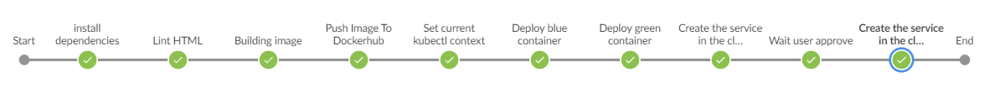

# DevOpsBlueGreenDeploy
a repo to test CICD process with a Blue green deploy strategy with Jenkins



## Project Overview

In this project, we have developed a CI/CD pipeline for micro services applications with either blue/green deployment
there is continuous integration that includes typographical checking (aka “linting”). the continuous deployment includes
* Pushing the built Docker container(s) to the Docker repository
* Deploying these Docker container(s) to a small Kubernetes cluster
* These run from within Jenkins as an independent pipeline.

### Project Goal

The project goal is to recreate all the modules that were learnt as part of the devops nanodegree program.
created a CI/CD pipeline for a basic website that deploys to a cluster in AWS EKS which is Blue/Green Deployment.
-   Working in AWS
-   Using Jenkins to implement Continuous Integration and Continuous Deployment
-   Building pipelines
-   Working with CloudFormation to deploy clusters
-   Building Kubernetes clusters
-   Building Docker containers in pipelines

The deployment has 2 phases
- deploying the EKS cluster using a pipeline running from Jenkins
- deploying the code pipeline by
	- creating an image in docker and uploading to docker hub
	- orchestration via kubernetes 
	- setting up the configuration and load balancing to enable a blue/green deployment

## Setup the Environment

The entire project is run in a virtual environment 
Below is the command to initialize the virtual environment
```
python3 -m venv ~/.devops
source ~/.devops/bin/activate
```

* **[Makefile](./Makefile)**:  JInstalling dependencies via project `Makefile`. Many of the project dependencies are listed in the file `requirements.txt`; these can be installed using `pip` commands in the provided `Makefile`. While in your project directory, type the following command to install these dependencies.

```
make install
```
*  **[Dockerfile](./final-project-server-parameter.json)**:  Docker can build images automatically by reading the instructions from a  `Dockerfile`. The Dockerfile contains all the commands a user could call on the command line to assemble an image.To view the contents of the  `Dockerfile`  type:  `cat Dockerfile`. You can edit any file by opening it in a text editor and saving it

*  **[Jenkinsfile](./Jenskinsfile)**:  Has the entire CICD logic called out in steps to implement the features of linting, docker image creation, docker image upload , replication controller .loadbalancer 
*
*  **[EKScluster/Jenkinsfile](./EKScluster/Jenskinsfile)**:  Has the logic to create the initiate the kubernetes server.


## Other Libraries

While you still have your  `.devops`  environment activated, you will still need to install:
-   Docker --> To install the latest version of docker, choose the Community Edition (CE) for your operating system, [on docker’s installation site](https://docs.docker.com/v17.12/install/). It is also recommended that you install the latest, **stable** release:
-   Hadolint --> Install `hadolint` following the instructions, [on hadolint's page](https://github.com/hadolint/hadolint):
-   Kubernetes (Minikube)--> To run a Kubernetes cluster locally, for testing and project purposes, you need the Kubernetes package, Minikube. This operates in a virtual machine and so you'll need to download two things: A virtual machine (aka a hypervisor) then minikube. Thorough installation instructions can be found [here](https://kubernetes.io/docs/tasks/tools/install-minikube/).

> additionally l:

-   Jenkins
-   Blue Ocean Plugin in Jenkins
-   Pipeline-AWS Plugin in Jenkins
-  -   Pip
-   AWS Cli
-   Eksctl
-   Kubectl

### Running the app
- first trigger the jenkins workflow to create the EKS cluster
- then trigger the jenkins workflow to deploy the components


